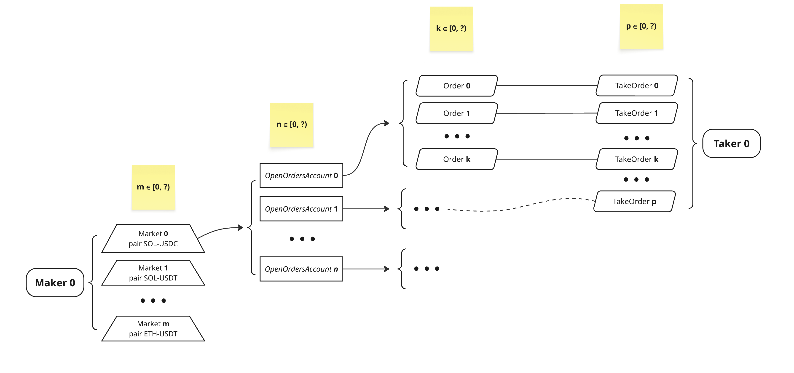
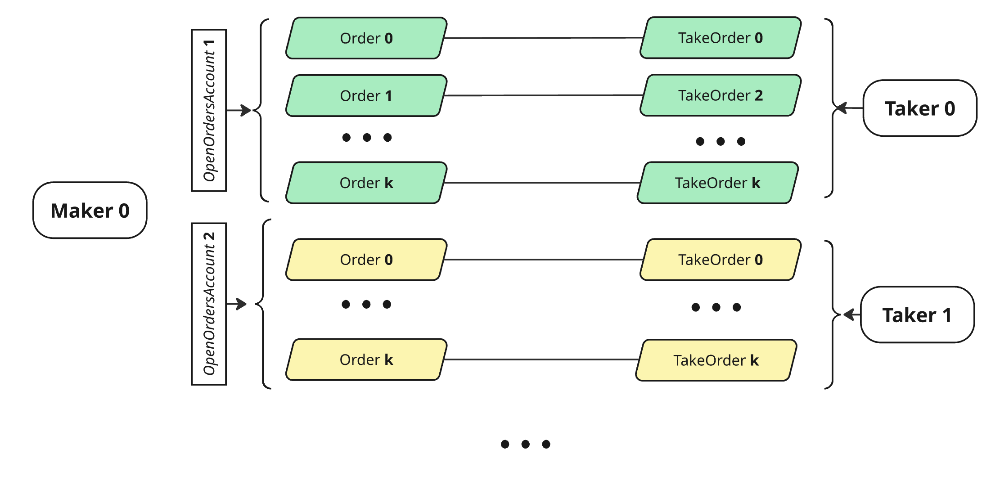

### Run
```bash
yarn install
```
```bash
yarn build
```

```bash
yarn ts-node ./tests/scenarios/testTradingLoad.ts
```

set trading config ./tradingConfig.ts

```JSON
const tradingConfig = {
    common: {
        makers: 2, // number of Makers
        markets: 2, //number of trading pairs per Maker
        tradingAccountsPerMakersMarket: 4, // number of OpenOrdersAccount per each Maker
        oredrsPerTradingAccount: 2, // number of orders per each Trading account, range [0, 24)
        ordersDistributionStrategy: "HalfSellHalfBuy", // number of orders with side ask = all order's number / 2, number of orders with side bid = all order's number / 2
    },
    consts: {
        initialAccountBalance: 500, // SOLs
        initialMintAmount: 100000, // tokens
        marketCreation: 2, // SOLs
        tokenCreation: 0.6, // SOLs
    },
    orders: {
        tradeQuantity: 10, // token's quantity to buy or to sell per one order
    }
}
```

Market scheme




Maker-Taker simplified orders matching




 run monitoring: prometheus and grafana containers

 ```bash
 cd tests/monitoring
 docker compose -f docker-compose.yml up -d
 ```


### Costs
- cost of a token creation ~ 0.6 SOL
- cost of one Market creation ~ 2 SOL
